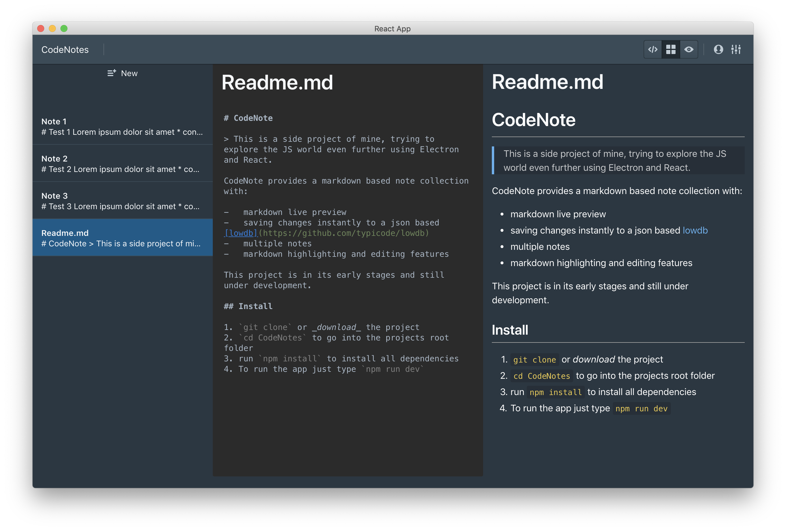

# CodeNote

> This is a side project of mine, trying to explore the JS world even further using Electron and React.

CodeNote provides a markdown based note collection with:

-   markdown live preview
-   saving changes instantly to a json based [lowdb](https://github.com/typicode/lowdb)
-   multiple notes
-   markdown highlighting and editing features

This project is in its early stages and still under development.

## Install

1. `git clone` or _download_ the project
2. `cd CodeNotes` to go into the projects root folder
3. run `npm install` to install all dependencies
4. To run the app just type `npm run dev`
